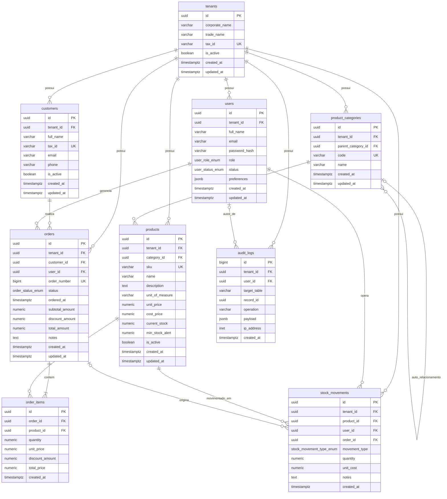

# AlmoxarifadoPro — Arquitetura de Dados Relacional

Este repositório contém o modelo relacional e DDL de banco de dados para um sistema integrado de gestão empresarial e almoxarifado/estoque multi-tenant, desenvolvido para **PostgreSQL 14+**.

O script completo de criação está disponível em [schema.sql](file:///c:/Users/Antigravity2/Documents/GustavoT/AlmoxarifadoPro/schema.sql).

---

## Diagrama Entidade-Relacionamento (ERD)

O diagrama a seguir descreve a estrutura relacional, chaves primárias (`PK`), estrangeiras (`FK`), atributos únicos (`UK`) e cardinalidades entre as entidades.



---

## Estrutura e Papel das Entidades

| Entidade | Descrição |
| :--- | :--- |
| `tenants` | Isolamento lógico multi-tenant por organização/empresa. Garante que dados de diferentes empresas permaneçam segregados. |
| `users` | Usuários do sistema, com perfis (`user_role_enum`), status (`user_status_enum`), credenciais com hash seguro e preferências em `jsonb`. |
| `customers` | Clientes ou parceiros comerciais atendidos pelas operações da empresa. |
| `product_categories` | Categorização hierárquica (auto-referência `parent_category_id`) para organização de itens e produtos. |
| `products` | Catálogo de itens do almoxarifado/venda, com controle de unidade, precificação, custo e parâmetros de reposição. |
| `orders` | Cabeçalho de pedidos de venda/ordens com identificador amigável (`order_number`), cliente, operador e valores. |
| `order_items` | Detalhamento dos itens do pedido com histórico congelado do preço unitário aplicado no momento da venda. |
| `stock_movements` | Histórico (Kardex) auditável de todas as movimentações físicas (entradas, saídas, ajustes, transferências). |
| `audit_logs` | Trilha de auditoria para operações de escrita (`INSERT`, `UPDATE`, `DELETE`) e autenticação, com diffs em `jsonb`. |

---

## Decisões Arquiteturais e Boas Práticas

1. **Chaves Primárias e Integridade:**
   - Utilização de `uuid` gerados nativamente por `gen_random_uuid()` no PostgreSQL 14+, prevenindo enumeração sequencial e facilitando replicação e arquiteturas distribuídas.
   - Chave `bigint GENERATED ALWAYS AS IDENTITY` utilizada no log de auditoria e sequencial legível no número de pedido (`order_number`).
2. **Normalização (3FN) e Desnormalizações Controladas:**
   - `products.current_stock`: Mantido como saldo materializado para leituras de alto throughput em sistemas OLTP, sendo sincronizado estritamente pelas movimentações em `stock_movements`.
   - `orders.total_amount`: Mantido para consultas agregadas e fechamento contábil rápido.
3. **Tipagem e Precisão:**
   - Valores monetários e quantitativos modelados com `numeric` para evitar erros de ponto flutuante.
   - Timestamps definidos com `timestamptz` para preservar o fuso horário correto.
   - `jsonb` restrito a atributos com esquema flexível (`preferences`, `audit_logs.payload`).
4. **Indexação:**
   - Todas as chaves estrangeiras (`FK`) indexadas para acelerar junções e evitar gargalos de locks em exclusões em cascata.
   - Índices compostos cobrindo filtros de alta frequência e índice `GIN` para busca rápida nos metadados de auditoria.

---

## Execução

Para provisionar o banco de dados localmente ou via pipeline de CI/CD:

```bash
psql -h <host> -U <usuario> -d <nome_do_banco> -f schema.sql
```
